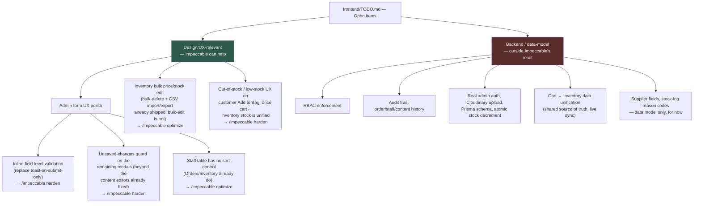

# Impeccable Design/UX Tasks

Tracks the findings from the `/impeccable critique` pass run on 2026-09-07 across the
customer and admin flows. Full reports: `.impeccable/critique/2026-09-07T00-48-54Z__customer-flow.md`
and `...__admin-flow.md`. Update this file as items get picked up — check them off, don't delete them,
so the history stays visible.

---

## Goal: full redesign/fix pass, customer + admin

We are redesigning and fixing the design/UI-UX on **both** the customer-facing site and the
admin panel. The bar is a high design standard — this should read as a bespoke, considered
product, never as generic AI-generated output ("AI slop": template-interchangeable layouts,
shadcn-card-with-shadow clichés, filler copy, inconsistent spacing, decorative-only elements).

Use the **`impeccable`** skill (installed at `.claude/skills/impeccable`, durable context in
`PRODUCT.md`) as the primary toolset for this work — `/impeccable critique`, `/impeccable audit`,
`/impeccable polish`, `/impeccable bolder`/`quieter`/`distill`, etc. — rather than ad hoc design
changes, so every pass stays anchored to this codebase's actual design system (`frontend/CLAUDE.md`
Design Rules + Design Tokens) instead of drifting toward generic patterns.

The task lists below (Admin Flow, Customer Flow) are the current backlog this goal is worked
through — check items off as they land, and add newly-found issues here as the redesign
continues past what the initial critique caught.

---

## Layout/structure pass (2026-09-07, follow-up)

User feedback after the visual-craft pass below: it was color and hover-state polish, not actual
layout change — "REBUILD THE LAYOUT." Ran `impeccable detect --json --scope layout` first, which
came back empty — confirmed (per the tool's own `layout.md`) that the mechanical scanner can't
prove structure/hierarchy either way; the real work is the manual assessment in that doc (reading
order, grouping, rhythm, topology, density), applied properly this time instead of defaulting to
"add a hover state." These are actual topology changes, not decoration:

- [x] **Shop page (`app/shop/page.tsx`)**: was a filter row (Search + Category `<select>` + Sort
      `<select>`) above a plain grid — the filter row scrolled away, and Category was a cramped
      dropdown for the one filter people actually browse. Rebuilt as a real two-column layout:
      persistent left sidebar (sticky) with Search + a vertical Category list (with live counts)
      + the active concern tag, and the result grid + Sort control in the main column. Skeleton
      rebuilt to match.
- [x] **PDP (`app/shop/[id]/page.tsx`)**: the details column was one flat stack of elements all
      sharing the same `mt-*` spacing scale — no structural grouping at all. Split into two real
      clusters — identity (category/title/rating/price/description, tight rhythm) and purchase
      action (quantity/size/add-to-bag, its own tight rhythm) — separated by one generous gap and a
      hairline rule. Grid ratio changed from an even 50/50 split to a slightly image-led `1.05fr/1fr`
      (photography-led per brand direction), and the image column is now `sticky` so it stays in
      view while a taller details/size column scrolls, instead of both columns just scrolling
      together with no relationship.
- [x] **Homepage Catalogue teaser (`components/sections/Catalogue.tsx`, `components/ui/Card.tsx`)**:
      was a uniform grid of identically-sized cards — the one homepage section with no hierarchy at
      all, unlike BestSellers/Journal/Moments, which all lead with one larger element. Added a
      `size` prop to the shared `Card` component (`"default" | "large"`, opt-in, every other call
      site unaffected) and made the first visible product span 2×2 grid cells with genuinely larger
      type/padding, not just a bigger box around the same small card.

Verified together: `tsc --noEmit` clean, `eslint` clean, full production build compiles all 31
routes (confirms `Card`'s new optional prop doesn't break its other call sites — Shop, Wishlist,
PDP's related-products list).

- [x] **Cart (`app/cart/page.tsx`)**: checked with the same rigor, no change made. Its fixed-sidebar
      summary (collapsing to a mobile bottom bar) is a genuine, deliberately-built structure — not
      a generic default — so it was left alone rather than changed for its own sake.

### Round 2 — Account, Journal/Rituals, and all three admin groups

Re-ran with much more pointed instructions (explicit worked examples above as the bar, told
directly that "already has hover states" ≠ "restructured"):

- [x] **Account area**: `account/page.tsx`'s generic avatar-column/form-column split (avatar had
      almost nothing to fill its own column) became one inline identity cluster. `password/page.tsx`
      lost a fake two-column shell (the second column held one orphaned caption) for a single-column
      form split into verify/set-new clusters. `notifications/page.tsx` split a flat 3-toggle list
      into labeled Account/Marketing groups. `purchases/page.tsx` (highest-value): consolidated 5
      co-equal row columns into 3 real groups, and — the biggest single change — surfaced the order
      tracker **inline in the row** for in-progress orders instead of hiding it behind a modal click,
      since it's arguably the most decision-relevant content on the whole page. `AccountShell`,
      `addresses`, `vouchers`, and `help` were checked and left alone with real reasoning (each
      already has a genuinely earned structure — persistent nav, sorted/color-coded address list, a
      ticket-perforation card split, appropriately-sized FAQ accordion).
- [x] **Journal + Rituals**: `JournalArticle.tsx` (highest-value) split its single centered column
      into a reading column + a sticky metadata/share rail (date, computed reading time, a working
      "Copy link"). The homepage-adjacent `journal/page.tsx` list gave its second-most-recent post a
      spanning/large treatment so recency — the thing that actually orders this content — reads
      structurally. **`rituals/[id]/page.tsx`** (largest single change of this round): replaced a
      plain product grid (visually identical to `/shop`) with a real curated-bundle structure — a
      sticky rail (running total, product count, a numbered step-nav) beside a sequential numbered
      list of full step rows, so the page actually communicates "one ordered routine," not "a list of
      products that happen to be grouped."
- [x] **Admin Dashboard/Orders/Inventory**: Dashboard (highest-value) merged two floating,
      always-together concerns ("Low Stock" + "Expiring Soon") into one "Inventory Alerts" panel, and
      **reordered the whole page** by actual information priority — action-needed content (Recent
      Orders + Inventory Alerts) now leads, analytical charts come second, Top Products (lowest daily
      urgency) last — instead of charts-first for no priority reason. Orders got a real spacing fix
      separating "narrowing the list" (filters) from "the list itself" as distinct clusters.
      `ProductModal.tsx` got section dividers (Identity / Pricing & Stock / Availability) on what was
      one undifferentiated run of fields. Explicitly did NOT add a persistent filter sidebar to
      Orders/Inventory/Staff (considered and rejected with real reasoning: thin single-facet filter
      surface + already-paginated to 10 rows + an existing persistent nav rail — a second sidebar
      would clutter, not clarify, unlike Shop's genuinely multi-facet browse case). Inventory's
      Movements log and `OrderModal.tsx` checked and left alone — both already earn their shape.
- [x] **Admin Staff/Settings**: Staff's toolbar and table columns regrouped by actual relationship
      (identity cell vs. permission cell, instead of 4 equal-weight columns) rather than adding a
      sidebar (same reasoning as Orders/Inventory — one real facet, not a multi-facet browse task).
      Built a new shared `SettingsSection`/`SettingsList`/`SettingsRow` component set so the three
      settings sub-pages — which each independently hand-built the same "list of label+control rows"
      shape — now share real structural DNA, while the one genuinely different page (the password
      form, which needs an explanatory aside) correctly kept its own shape instead of being forced
      into the shared mold. Flipped the admin login screen's visual priority: the sign-in form now
      leads, the brand panel trails as supporting context, since the form is demonstrably the actual
      task (it's the only thing that renders at all below `lg`).
- [x] **Admin Content/CMS editor chrome**: added an opt-in `compact` mode to `ContentEditorShell` so
      density tracks content complexity — a 1-2-short-field editor (`CatalogueEditor`,
      `PageIntroEditor`) no longer gets the identical full-width, full-padding treatment as a
      12-field editor. Editors with a textarea or genuinely multi-field forms correctly kept the
      full-width rhythm — content decided, not a blanket resize. Checked whether every list tab's
      structural divergence (pagination, view-modal, back-link presence) was arbitrary or
      content-driven — found it was content-driven in every case (unbounded-growth lists paginate,
      lists whose rows truncate real content get a view-modal) and left them as-is.

All 5 groups verified together: `tsc --noEmit` clean, full `eslint` clean (same two pre-existing,
unrelated issues as always), full production build compiles all 31 routes.

---

## UI/UX Makeover — visual craft pass (2026-09-07 onward)

A second, distinct pass from the critique-fix backlog below: not correctness/UX-heuristic bugs, but
actual visual craft — typography, color, layout rhythm, hierarchy, earned personality — using
Impeccable's Refine/Enhance commands (`bolder`/`quieter`/`distill`/`typeset`/`colorize`/`delight`/
`layout`), closing each surface with `/impeccable polish`. Refining the existing editorial direction,
not redesigning it. Plan: `C:\Users\jbesayte\.claude\plans\now-do-the-ui-ux-prancy-snowglobe.md`.

- [x] **Step 0 — Color refresh.** User feedback: the palette read as "dead/boring," especially on
      customer pages. Root cause confirmed in `app/globals.css`: the whole pink family was a muted
      wine tone, and blue only ever appeared as near-black (`ink`/`navy`) or near-white (`blue-soft`)
      — no real mid-tone blue anywhere. Presented 3 candidate refreshes as a visual comparison
      (published artifact, not hex-in-prose); user picked **"Vivid Berry + Cobalt."** Applied at the
      token level: `pink-btn`/`pink-btn-hover` → `#CC195B`/`#AD154D`, `pink`/`pink-dark` →
      `#E56C94`/`#9C0D48`, new `blue-accent`/`blue-accent-hover` role → `#2866BD`/`#205298` (added to
      `tailwind.config.ts`'s `blue` group). Same lightness as the old values at each role, so
      button-text contrast is unchanged (verified ~5.5:1, comfortably passes WCAG AA) — only
      saturation/hue moved. `ink`/`navy`/`footer`/`gold`/`success`/`alert`/`grey` untouched.
      `frontend/CLAUDE.md`'s Design Tokens table updated to match. Verified: `tsc --noEmit` clean,
      full production build compiles all 31 routes.
- [x] **Group 1 — Homepage** (`app/page.tsx` + ~12 sections). The structural craft here was already
      strong per the original critique (asymmetric BestSellers layout, Testimonials carousel,
      skeleton parity) — the actual gap was color/interactivity feeling flat, so this pass targeted
      that specifically rather than restructuring sections that already had conviction:
      - Product/concern titles that had zero hover feedback (`Card.tsx`, `BestSellers.tsx`,
        `Glossary.tsx`) now shift to `pink-dark` on hover, matching the "Add to Bag" hover-reveal
        pattern already established elsewhere.
      - The two `blue-soft`-tinted sections (Journal, Testimonials) now carry an actual
        `blue-accent` moment instead of defaulting to pink everywhere — Journal's post-list hover
        and Testimonials' avatar circle (was `bg-navy`, functionally invisible as "blue"). This is a
        deliberate rule, not random sprinkling: pink-tinted sections get pink accents, blue-tinted
        sections get the blue accent.
      - FAQ's accordion trigger and "Get in touch →" link were completely monochrome (no hover
        feedback at all) — now shift to `pink-dark` on hover/open, consistent with the section's
        `pink-soft` tint.
      - **Deliberately left alone**: Philosophy (explicit prior user feedback against adding any
        reveal-motion to this section — only touched by inheriting the token refresh automatically),
        Hero (photography-led hero intentionally stays neutral white/dark so the photo carries the
        color), Contact/Newsletter (already used the accent system correctly).
      Verified: `tsc --noEmit` clean, `eslint` clean on all touched files, full production build
      compiles all 31 routes. No visual regression tooling exists (no Playwright this session) —
      this is code-level verification, not a rendered screenshot check.
- [x] **Post-Group-1 fixes from live screenshots.** User checked the actual rendered homepage and
      sent back two corrections:
      - **Philosophy still animated in on scroll.** Clarified/strengthened the standing memory:
        Philosophy must be fully static — same as Contact/Newsletter/Footer, zero reveal motion.
        Removed the `FadeIn` wrapper entirely (was previously just "don't add more," now "remove it").
      - **Shop by Concern read as the plainest section on the page** — a left-stranded row of
        thumbnail-plus-caption-below tiles with a large dead gap on wide viewports, next to sections
        that all use full-bleed photo + overlaid text (Hero, Moments/Rituals, Journal's featured
        card). Restructured `Glossary.tsx`'s tiles to match that established device — caption now
        overlays the photo with a bottom gradient scrim instead of sitting in a separate block below
        — and centered the row (`justify-center`, still scrolls if the list overflows) so it doesn't
        strand left with dead space.
      - General instruction from this feedback: apply real restructuring where a section is
        genuinely weaker than its neighbors, not just color/hover polish — carrying this into the
        remaining groups below.
      Verified: `tsc --noEmit` clean, `eslint` clean, full production build compiles all 31 routes.
- [x] **Group 2 — Shop + PDP** (`app/shop/page.tsx`, `app/shop/[id]/page.tsx`, `Card.tsx`).
      - `PageIntro.tsx` (shared by Shop/Wishlist/Cart/Journal) was a bare headline with no editorial
        device at all — added a mono eyebrow label + hairline divider matching the homepage's
        `SectionTitle`, so four pages get real header identity from one change.
      - PDP (`shop/[id]/page.tsx`): product image was a flat bordered square with no hover life and
        an inconsistent `aspect-square` (every other product photo on the site is `aspect-[4/5]`) —
        fixed both, added the same `group-hover:scale-[1.03]` zoom `Card.tsx` already uses.
      - PDP's wishlist toggle button was `h-9 w-9` (36px) — missed by the earlier accessibility
        sweep since it's a plain `<button>` here, not the `role="button"` span pattern that sweep
        covered. Bumped to `h-11 w-11` (44px).
      - Shop grid itself (`app/shop/page.tsx`) judged fine as-is: a uniform comparison grid is
        correct for a full paginated catalog (Operate-leaning even on the customer site — consistency
        beats drama when comparison-shopping), unlike the homepage's curated/asymmetric sections.
      Verified: `tsc --noEmit` clean, `eslint` clean, full production build compiles all 31 routes.
- [x] **Group 3 — Cart + Account area.** `AccountShell.tsx`'s sidebar nav had a flat grey active
      state with no brand color anywhere in the app's main navigation device — replaced with a
      left accent bar + `pink-soft` tint + `pink-dark` text, icon recolors in sync on hover. Added
      hover feedback to cart line-item titles, address "Change" link, "Continue Shopping", account
      "Change Photo", help-page contact rows (icon-circle + arrow reveal), voucher cards, and the
      FAQ accordion. Bumped addresses' Edit/Remove icon buttons 32px→44px (the only sub-44px control
      found in scope). Empty-state icon circles (cart/addresses/purchases) went from flat grey to
      `pink-soft`/`pink-dark`. Correctly left the disabled checkout button and the order-tracker's
      status colors alone — already used meaningful tokens, not flat-grey misuse.
- [x] **Group 4 — Journal + Rituals + static pages.** Fixed a real spacing bug in
      `JournalArticle.tsx` (two stacked top-padding wrappers left ~110-130px of dead space below
      the hero); gave the lead paragraph real typographic hierarchy. Added a `SectionTitle`
      num+title+rule device to "More from the Journal" and Rituals' "What's in it" row (previously
      bare labels), with real hover-fill on the prev/next nav links. `JournalCard.tsx` got the
      standard border-brighten-on-hover. Static legal pages got the same eyebrow+divider header
      device as Shop/Cart/Journal — a light, correctly-scoped pass, nothing elaborate.
- [x] **Group 5 — Admin Dashboard + Orders + Inventory.** These three pages read as separately-built
      screens sharing components rather than one system — fixed the seams: Inventory's table
      lacked the `shadow-card` elevation Dashboard's cards already use (added, plus fixed an
      internal row-padding mismatch, `py-3` vs `py-3.5`, within Inventory's own rows); Orders'
      5 status-count filter cards had no shadow and signaled "selected" with only a 1px border
      (too subtle for an at-a-glance control staff use constantly) — added `shadow-card` +
      hover-lift + a `pink-soft` active fill; `OrderModal`'s status `<select>` was missing the
      `focus-visible` ring every other control has and was shorter than the `h-11` standard — both
      fixed. `formClasses.ts`'s shared `ICON_BTN`/`ICON_BTN_DANGER` were still 32px, left behind
      when the rest of the system moved to the 44px standard — bumped both to `h-11 w-11` (this
      change is global, so it also benefits Staff/Content, which is why it's mentioned here but
      matters beyond this group). Charts/StatCard reviewed and left alone — already had real
      grids/baselines and validated colorblind-safe palettes, nothing decorative to strip.
      **Follow-up fix** (found via a cross-group comparison after all groups landed): Inventory's
      bulk-delete button used `text-alert` on the dark `BulkActionBar` at rest — computed contrast
      ~2.2:1, fails WCAG AA. Fixed to match Staff's already-accessible pattern (white text at rest,
      alert only on hover).
- [x] **Group 6 — Admin Staff + Settings.** `settings/page.tsx`'s password fields hand-rolled
      near-duplicate classes of `FIELD_INPUT`/`FIELD_LABEL`/`BTN_PRIMARY` instead of using them —
      replaced with the shared tokens. The Two-Factor row floated without the bordered-row
      treatment Notifications/Sessions already use — wrapped to match. Sessions' "Log out all
      other devices" was permanently disabled with a dead-looking treatment despite having a
      working (demo) handler — enabled it with `BTN_SECONDARY`, consistent with every other working
      action in Settings. Added missing `autoComplete` hints to the admin login form. Correctly
      declined to "fix" Staff's bulk-delete button to match Inventory's — computed that Inventory's
      version actually failed contrast (see Group 5's follow-up fix above) and left Staff's
      accessible version alone rather than propagating the regression.
- [x] **Group 7 — Admin Content/CMS editor chrome.** Read the whole shell + every editor/tab before
      changing anything, and correctly left most of it alone (it was already highly consistent).
      Four genuine drifts fixed: `ContentEditorShell`'s shared title was `text-lg` while every
      other section heading in Content is `text-[15px]`; `PromotionsTab` hand-rolled its own copy
      of `ICON_BTN` instead of importing the shared constant; `FaqEditor` was missing the
      back-link/heading structure its own sibling tabs (Concerns/Rituals/Testimonials) all use —
      confirmed by a comment in `TestimonialsTab` explicitly saying it needed to match Hero/About/FAQ;
      `PageIntroEditor`'s Headline/Accent fields were stacked full-width while the identical pair in
      `NewsletterEditor`/`ContactTab` uses a 2-column grid. Flagged (but correctly did not touch,
      since `formClasses.ts` was off-limits for this group) that `ICON_BTN` was still 32px — this
      was independently fixed by the Group 5 agent to 44px, resolving the flag.

All 7 groups verified together: `tsc --noEmit` clean, full `eslint` clean (only the same two
pre-existing, unrelated issues present since before this session), full production build compiles
all 31 routes.

---

## Admin Flow — 26/40 → 32/40 (Acceptable → Good, re-run 2026-09-10)

Everything found in the original pass is applied, including both items previously left open.
See "Re-critique + fix pass (2026-09-10)" below for the re-run's own findings and fixes.

### Done

- [x] **[P0] Content editor Save/Discard was fiction.** Hero/About/Philosophy/Newsletter/PageIntro/
      Catalogue/Contact/Social-Links editors now stage drafts locally and only push to the live
      shared content on Save; Discard actually discards. Live preview still updates via a new
      `previewData` prop on the section components.
- [x] **[P1] No confirmation on order status changes.** Changing an order to "Cancelled" in
      `OrderModal.tsx` now requires confirmation via `ConfirmModal`.
- [x] **[P1] Staff deletion had no last-admin guard.** `adminStore.tsx`'s `deleteStaff` now blocks
      deleting the last remaining Administrator, with a toast explaining why.
- [x] **[P1] Systemic accessibility gaps.** Real `focus-visible` rings added sitewide (was
      `outline-none`-only via `formClasses.ts`), `htmlFor`/`id` pairs added across ~15 previously
      unlabeled forms, keyboard operability (`role`, `tabIndex`, `onKeyDown`) added to 5 mouse-only
      table rows, `scope="col"` added to every admin table header, Escape-key + `aria-expanded`/
      `aria-haspopup` added to the topbar's notification/profile dropdowns.
- [x] **[P2] No bulk actions or keyboard shortcuts anywhere in the panel.** Orders/Inventory/Staff
      tables now have a checkbox column + shared `BulkActionBar` (`components/admin/BulkActionBar.tsx`):
      Orders gets bulk status update (with confirm on bulk-Cancel) + CSV export; Inventory gets bulk
      delete + CSV export, and its toolbar Import/Export buttons are wired (Export now does a real
      CSV download of the filtered list, Import shows an honest "not wired up yet" toast instead of
      doing nothing); Staff gets bulk delete (respecting the last-Administrator guard). `"/"` now
      focuses the page's search field from anywhere (`SearchField.tsx`), and `"n"` triggers "+ Add"
      on Staff (Inventory already had click-to-add; add "n" there too if it's ever revisited).
- [x] **[Minor] Notification Preferences page doesn't persist and gives no feedback.** Now has a
      `// TODO: persist to backend` comment and toasts "Preference updated (demo only — not saved
      yet)" on every toggle, so a click is no longer silent either way.
- [x] **[Minor] Collapsed sidebar uses a native `title` tooltip** — now uses the shared `Tooltip`
      component like every other icon-only affordance in the panel.
- [x] **[Minor] `PagesTab.tsx`'s non-editable "Best Sellers" row** now shows a muted name plus a
      "No editor" `StatusBadge` so it's obvious without clicking.
- [x] **[Minor] `useAsyncAction.ts` simulates a fixed 700ms delay** — now has an explicit `// TODO`
      flagging it as demo-only and due for removal once real API calls exist (delay itself
      unchanged, this was a documentation-only fix).
- [x] **[P1, previously blocked] Staff self-deletion guard.** `adminStore.tsx`'s `login()` now
      best-effort matches the entered email against `StaffMember.email` and stores the match as
      `currentStaffId` (localStorage-persisted, cleared on logout). `deleteStaff`/`bulkDeleteStaff`
      and `staff/page.tsx`'s `requestDelete` all block deleting that id with a clear toast. This is
      still not real auth (any email/password logs in; a non-matching email just means the guard
      doesn't apply) — full enforcement still needs the real admin auth in `frontend/TODO.md`'s RBAC
      gap, but it's no longer a no-op for the common case of an admin logging in with their own
      real staff email.
- [x] **[Follow-up] Inventory import is now real (CSV, not Excel).** Added `parseCsv` to
      `library/admin/csv.ts` and a `bulkAddProducts` store action; the Import button opens a real
      file picker, validates each row (name/SKU-uniqueness/category/price/stock), imports the valid
      ones in one batch with one summary toast, and reports skipped rows (reasons logged to
      console). Scoped deliberately to this codebase's own CSV shape (matching Export) rather than
      true `.xlsx` — each imported row becomes a simple single-price/single-stock product, no size
      variants/expiry/photo reconstruction. Toolbar comment updated to describe this honestly.

---

## Customer Flow — 29/40 → 32/40 (Good, re-run 2026-09-10)

Everything found in the original pass is applied. See "Re-critique + fix pass (2026-09-10)" below
for the re-run's own findings and fixes.

- [x] **[P0] Checkout is a dead end.** `app/cart/page.tsx` — "Proceed to Payment" is now a real
      `disabled` button (both the desktop sidebar and mobile fixed-bar copies) with a caption
      explaining checkout isn't available in this preview, instead of an identical-looking working
      CTA that just toasted on click. Full checkout still needs the backend payment integration —
      this only fixes the *honesty* of the button's current state.
- [x] **[P1] Login gate loses the user's original action.** `library/store.tsx` now captures the
      blocked add-to-cart/wishlist call as `pendingAction` and replays it once `signIn` succeeds
      (via an effect keyed on `isLoggedIn`, not a stale closure — see the code comments for why).
      Cleared if the login modal is dismissed without signing in.
- [x] **[P1] No state persistence.** `library/store.tsx` now persists cart/wishlist/addresses/login
      to `localStorage` and rehydrates once on mount, mirroring `adminStore.tsx`'s existing session
      pattern — a refresh no longer wipes anything.
- [x] **[P1] Sitewide form/control accessibility gaps.** `htmlFor`/`id` pairs added across Contact,
      Login/Signup (+ forgot-password), account profile/password/addresses; both wishlist-toggle
      spans (`Card.tsx`, `BestSellers.tsx`) are now keyboard-operable; Navbar icons, wishlist
      toggles, PDP qty stepper, and modal close buttons all brought up to 40-44px touch targets.
- [x] **[P2] Homepage catalogue filters are fully-styled but dead.** `Catalogue.tsx` now filters
      its own product grid for real (category/price-bucket/rating, with an empty state) rather than
      routing out to `/shop` — chosen because it already shows a slice of the full catalogue, not a
      tiny fixed teaser, so in-place filtering behaves like a real mini shop grid.
- [x] **[Minor] Two divergent Privacy Policy implementations.** `app/account/privacy/page.tsx`
      deleted; the account sidebar link now points at the CMS-driven `/pages/privacy-policy`, same
      as Terms/Shipping & Returns.
- [x] **[Minor] Welcome promo modal fires on a flat 1.4s timer.** Now opens on scroll depth
      (~90% of viewport height, roughly past the Hero) instead of a flat timeout; the existing
      once-only guard is unchanged.
- [x] **[Minor] `account/notifications/page.tsx` toggles give no save confirmation.** Now toasts
      "Preference updated." on every toggle, matching the other account pages.
- [x] **[Minor] Newsletter's decorative star row misused the "gold = ratings only" rule.** Removed
      entirely rather than wired to real data — it's a sitewide subscribe CTA, not attached to any
      product, and `library/reviews.ts` has no sitewide aggregate to honestly wire it to. The
      existing "Loved by 12,000+ skincare routines" copy already carries the social-proof message.
- [x] **[Minor] No `prefers-reduced-motion` handling.** Added a shared `usePrefersReducedMotion()`
      hook (`components/ui/motion/constants.ts`, via `useSyncExternalStore`); `FadeIn`/`RevealIn`/
      `TypeReveal` all render statically when the preference is set, unchanged otherwise.

---

## From `frontend/TODO.md` — where Impeccable fits

`frontend/TODO.md` tracks its own backlog (SEO/responsive work, inventory/cart architecture). Most
of it is backend/data-model engineering, not visual design — Impeccable's commands (`critique`,
`audit`, `harden`, `optimize`, `polish`, etc.) only help with the UI/UX-surfaced portion of each
item. This is a map of that split, so future passes know which TODO.md items are actually
Impeccable's to pick up versus which need an engineer first.

### Design/UX-relevant — status

- [x] **Inline field-level validation errors.** Added `FIELD_ERROR`/`FIELD_INPUT_INVALID` to
      `formClasses.ts` and a shared `useIsDirty` hook; applied to all 8 admin CRUD modals
      (Product, Staff, Testimonial, Concern, Faq, FooterLink, NavLink, Ritual) — each now shows an
      inline message under the invalid field (plus a summary toast) instead of a silent no-op or
      toast-only error. Two modals (Concern, Ritual) gained genuinely new checks for their
      image/product-selection fields that weren't validated at all before.
- [x] **Unsaved-changes guard on remaining modals.** The same 8 CRUD modals above now show a
      "Discard changes?" `ConfirmModal` if closed (backdrop/Escape/× — all paths) while dirty,
      matching the draft/discard flow the content editors already got in the P0 fix.
- [x] **Staff table has no sort control.** Added a Sort dropdown (Name A–Z/Z–A, Role
      Admins/Staff-first) matching Orders/Inventory's exact toolbar pattern.
- [x] **Inventory bulk price/stock edit.** Added a "Bulk Edit" action to the `BulkActionBar` —
      adjust stock by a delta and/or set price to a value across the selection in one apply, via a
      new `bulkAdjustProducts` store action and `BulkEditProductsModal`. Products with size variants
      are deliberately skipped (reported in the summary toast) rather than guessed at, since their
      price/stock is a derived aggregate across sizes, not a direct field.
- [ ] **Out-of-stock / low-stock UX on the customer Add to Bag flow.** Still blocked — needs
      `frontend/TODO.md`'s §1 cart↔inventory data unification to land first (an engineering task,
      not a design one) before there's real stock data to design this UX against.
      Suggested when ready: `/impeccable harden`.

### Explicitly out of scope for Impeccable

These are real, tracked gaps in `frontend/TODO.md` — but they're backend/data-model work, not
something a design skill fixes. Listed here only so nobody goes looking for an Impeccable command
for them:

- RBAC not enforced (`StaffMember.role` exists as data, nothing checks it)
- Audit trail covers only inventory stock movements, not orders/staff/content
- Admin settings password-change and 2FA are intentionally faked (`// TODO`)
- Real admin auth, Cloudinary photo upload, Prisma schema, optimistic locking, atomic stock
  decrement — all explicitly "backend-dependent" in `frontend/TODO.md` §3
- Cart ↔ Inventory data unification itself (picking one source of truth, syncing stock) — the
  *data/state* half of `frontend/TODO.md`'s §1; only its UI symptom (D3 above) is Impeccable's

### Note: `frontend/TODO.md`'s stale line has been fixed

Its "Admin form UX polish" bullet used to list *"Import/Export buttons on Inventory are UI-only"* —
that was no longer true as of this session's admin P2/follow-up work (Export was already real,
Import now does real CSV parsing/validation). Checked off and updated in `frontend/TODO.md` directly
to reflect all four sub-items being done (inline validation, unsaved-changes guard, Staff sort,
Import/Export).

---

## Re-critique + fix pass (2026-09-10)

Re-ran full dual-assessment `/impeccable critique` on both flows now that every item above is
applied — customer flow **29 → 32/40**, admin flow **26 → 32/40**, both "Good". Reports:
`.impeccable/critique/2026-09-10T02-58-31Z__customer-flow.md` and
`...T02-58-20Z__admin-flow.md`. User chose to fix everything found, customer flow first, with a
guest cart for the login-wall question and a full 9-editor audit before touching Blog's layout.

### Customer flow

- [x] **[P1] Cart quantity stepper bypassed the per-item cap.** `library/store.tsx`'s `changeQty`
      had no `MAX_PER_ITEM` check, unlike `addToCart` — the cart's own +/- stepper was the one place
      a shopper could exceed the 6-per-item limit. Now enforces the same cap, summed across size
      variants, with the same toast.
- [x] **[P1] Sitewide missing `focus-visible` ring on text inputs.** 26 occurrences across 15 files
      (Contact, Login/Signup/Forgot-password, Newsletter, WelcomePromoModal, ReviewModal, account
      profile/password/addresses, SearchField) relied on a border-color shift alone —
      `Toggle.tsx` was the only component doing this correctly. All now carry the same
      `focus-visible:ring-2 ring-navy ring-offset-1` treatment.
- [x] **[P1] Several inputs had no accessible name.** Newsletter and WelcomePromoModal's email
      fields, `SearchField` (shop/wishlist search), ReviewModal's author/review fields, and the
      Notifications page's `Toggle` rows (which already supported `ariaLabel`, just weren't passed
      one) now all have a real label or `aria-label`. LoginModal's OTP digits also gained per-digit
      labels ("Digit 1 of 6").
- [x] **[P2] No guest path — cart/wishlist gated into login at first touch, styled as an error.**
      User chose **guest cart, gate only at checkout**: removed the `isLoggedIn` check (and the
      `pendingAction` replay machinery it required) from `addToCart`/`toggleWishlist` in
      `library/store.tsx`, and removed the full-page login walls on `/cart` and `/wishlist` — both
      already persist to `localStorage` regardless of login state, so nothing else had to change.
      `Card.tsx`, `BestSellers.tsx`, and `rituals/[id]/page.tsx` simplified to call `addToCart`
      directly instead of duplicating the old gate. Deleted the now-unused `LoginRequiredModal`.
      Checkout itself (`Proceed to Payment`) stays disabled pending real backend work — a `TODO`
      now flags it as where a real login gate belongs once checkout exists.
- [x] **[P2] Mobile checkout dead-end had no visible explanation.** The mobile fixed bar's disabled
      "Proceed to Payment" only explained itself via a screen-reader-only `aria-label`, unlike the
      desktop sidebar's visible caption. Added the same visible caption to the mobile bar.

### Admin flow

- [x] **[P1] Systemic undersized UI text (10–10.5px, below the 11px floor) on every page.** Raised
      the three shared label tokens the live-DOM detector traced this to: `AdminSidebar`'s nav-group
      labels, `StatCard`'s label, and `formClasses.ts`'s `FIELD_LABEL` (10/10.5px → 11px) — plus the
      identical shared table-header label class (Orders/Inventory/Staff) and Dashboard's "Low
      Stock"/"Expiring Soon" panel captions, found via the same audit. Since `FIELD_LABEL`'s own
      comment ties it deliberately to the customer account pages' label style, bumped all 7 files
      sharing that exact literal class (customer account/password/addresses, Contact, LoginModal,
      `LinksTab`) to the same 11px so the two scopes stayed consistent rather than drifting apart.
- [x] **[P2] Blog editor's right rail nested cards-within-cards, contradicting its own design
      brief.** Audited all 9 `ContentEditorShell` consumers (7 editors + Blog + Promotions) first,
      per the brief's own instruction — confirmed none of them add their own extra bordered
      wrappers; the nesting came entirely from the shared shell itself, which wrapped the main
      fields in a plain bordered `
` sitting among header-stripped `MetaBox`es (Publish/Featured
      Image/Details). Fixed once in `ContentEditorShell.tsx` by wrapping `children` in a `MetaBox`
      too (labeled "Content"), so every box in the rail now shares the identical flat-card language —
      this fixes all 9 consumers uniformly, not just Blog.
- [x] **[P2] Layout-thrashing sidebar/content transitions, plus a live Dashboard text-overflow
      bug.** The sidebar's width transition and the content wrapper's matching margin transition
      (`(panel)/layout.tsx`) are genuine exceptions to "animate transform, not layout properties" —
      collapsing actually resizes the content area to use the freed space, an effect transform alone
      can't produce — so both got a `will-change` hint instead of a break-the-feature rewrite, with a
      comment explaining why. The Dashboard's Low Stock/Expiring Soon row-label overflow (18–38px
      past its box despite `truncate`) was a real bug: `min-w-0` was missing further up the
      flex/grid chain than the immediate wrapper, so the intrinsic width of the nowrap text was
      winning. Added `min-w-0` through the full chain (column → list → row).
- [x] **[P2] Tooltip was still hover-only — the one accessibility gap from the original report that
      never actually closed.** Added `group-focus-within/tooltip:opacity-100` alongside the existing
      hover variant in `Tooltip.tsx`, so every icon-only button's label is visible on keyboard focus,
      not just mouse hover.
- [x] **[P3] Settings security actions silently faked success with no signal they're inert.**
      Password change, 2FA toggle, and "Log out all other devices" now all carry the same
      "(demo only — not saved yet)" suffix already used on Notification Preferences.

Verified together: `tsc --noEmit` clean, `eslint` clean (same two pre-existing, unrelated issues as
every prior pass), full production build compiles all 31 routes.
